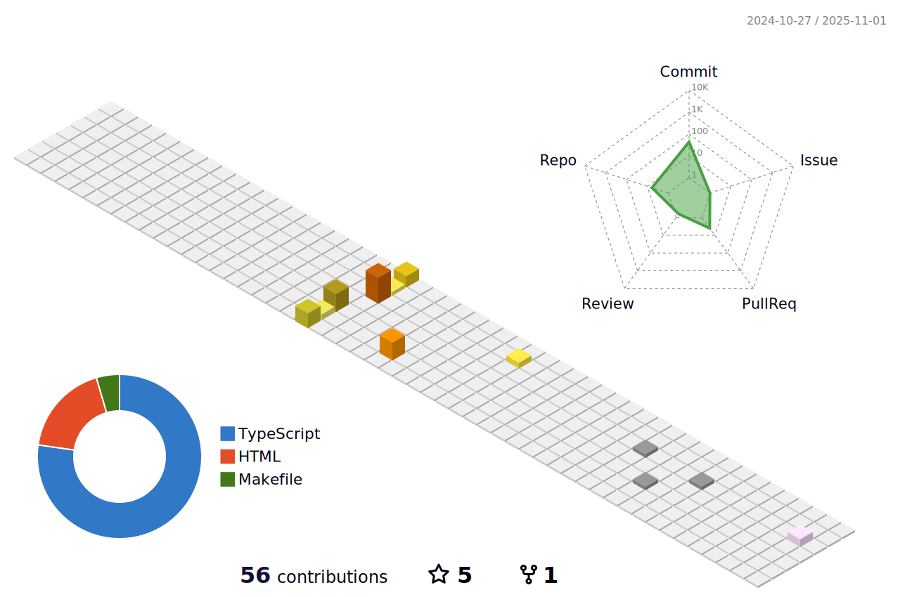

# Hi there👋 , My name is Oat,
> ### I'm a 2nd-year computer engineering student @KMITL | Bangkok,Thailand

#### *currently , I interested about how to be good software engineer . I try learning everything about technology to improve my skill & career path.* 
> #### I'm looking for software engineer(front-end) ,UX/UI design ,Data analytic internship.

## interested courses📚
1. mobile development
2. UX/UI design & Interacion design
3. machine learning 
4. data analytic & data visualization

 

[//]: 

|  |  |
| ------------- | ------------- |

## Mostly used

 

 
